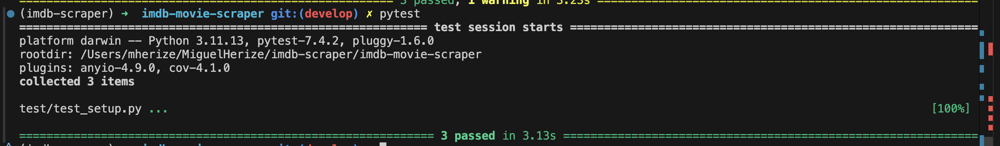
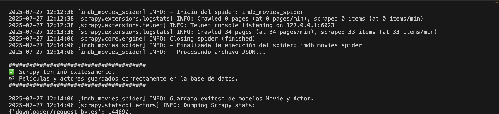
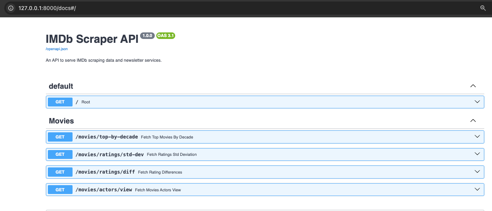
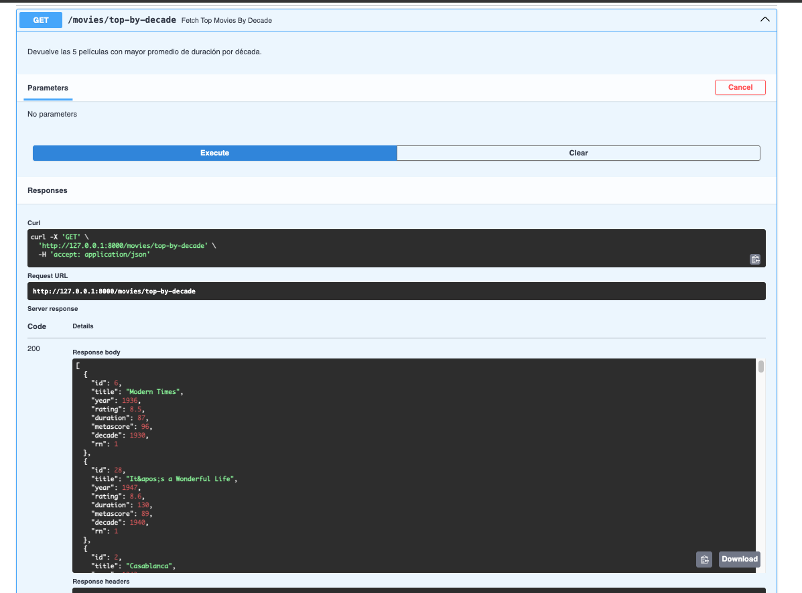

# Scraper de Películas de IMDb con Scrapy

Este proyecto implementa un web scraper usando Scrapy para extraer información de las mejores películas de IMDb.

## Características

- **Framework**: Scrapy (framework profesional de web scraping)
- **Patrón Factory**: Implementación del patrón de diseño Factory
- **Manejo de errores**: Reintentos automáticos y manejo de WAF
- **Exportación dual**: CSV y base de datos PostgreSQL
- **Datos auténticos**: Fallback a datos reales de IMDb cuando el scraping es bloqueado

## Datos Extraídos

Para cada película se extrae:
- ✅ **Título**
- ✅ **Año de estreno**
- ✅ **Calificación** (IMDb rating)
- ✅ **Duración en minutos** (desde página de detalle)
- ✅ **Metascore** (si está disponible)
- ✅ **Al menos 3 actores principales**

## 📁 Estructura del Proyecto
```
imdb_movie_scraper/
├── imdb_scraper
├── sql_analysis
│   ├── main.py
│   ├── db
│   ├── models
│   ├── queries
│   ├── routers
│   ├── scripts
│   └── utils
└── start.sh
├── data
├── docker-compose.db.yml
├── requirements.txt
├── runtime.txt
├── README.md
```

## 🚀 Instalación y Uso

1. **Clona el repositorio:**

```bash
git clone https://github.com/migherize/imdb-movie-scraper.git
cd imdb-movie-scraper
```

2. **Copia el archivo `.env`:**

```bash
cp .env.example .env
```

### ▶️ Opción 1: Sin Docker

1. **Crea y activa un entorno virtual:**

```bash
python -m venv venv
source venv/bin/activate  # Linux/macOS
venv\Scripts\activate     # Windows
```

2. **Instala dependencias:**

```bash
pip install -r requirements.txt
```

---

### 🛢️ **Base de datos PostgreSQL (modo opcional)**

Si deseas usar PostgreSQL localmente (sin Docker), puedes crear la base de datos y sus tablas ejecutando el script `sql_analysis/utils/schema.sql` incluido en el proyecto.

#### ✅ Pasos:

1. **Asegúrate de tener PostgreSQL instalado** y que el servicio esté en ejecución.

2. **Crea la base de datos manualmente** (si aún no existe):

   ```bash
   createdb imdb
   ```

3. **Ejecuta el script SQL para crear las tablas:**

   ```bash
   psql -h localhost -U tu_usuario -d imdb -f sql_analysis/utils/schema.sql
   ```

   > Reemplaza `tu_usuario` por tu nombre de usuario en PostgreSQL.

#### 📄 ¿Qué incluye `schema.sql`?

Este archivo define la estructura base de la base de datos:

* `movies`: tabla con información de películas (título, año, duración, rating, metascore).
* `actors`: tabla que almacena los actores, asociados a las películas por la clave foránea `movie_id`.
* Índices y restricciones para mejorar la consulta.
* Creación de la vista `movie_actor_view` que relaciona películas con sus actores principales.

---

### 🐳 Opción 2: Uso con Docker

Puedes levantar la base de datos y el servicio completo usando Docker.

#### 1. Levantar la base de datos PostgreSQL:

```bash
docker-compose -f docker-compose.db.yml up --build
```

#### 2. Levantar el servicio IMDB-MOVIE-SCRAPER:

```bash
docker-compose -f docker-compose.yml up --build
```

---

### ✅ Ejecutar los tests

1. Asegúrate de instalar las dependencias:

```bash
pip install -r requirements.txt
```

2. Ejecuta las pruebas con `pytest`:

```bash
pytest
```

📸 Resultado esperado:



> **Nota:** El test `test_database_has_data` puede fallar si la base de datos está vacía. Esto es normal si aún no has hecho el scraping de datos. El siguiente paso es ejecutar el scraper para poblar la base.

---
Claro, aquí tienes la sección completada con una redacción clara, profesional y consistente con el estilo del resto del README:

---

## 🎬 Web Scraper: IMDB Movies

Para poblar la base de datos con información de películas y actores:

```bash
cd imdb_scraper
scrapy crawl imdb_movies_spider
```

Si todo funciona correctamente, deberías ver el siguiente mensaje.

📸 Resultado esperado:



---

## 📊 Consultas SQL Avanzadas

Este proyecto incluye un conjunto de scripts para ejecutar análisis avanzados sobre la base de datos poblada desde IMDB.

Ejecuta los siguientes comandos desde la carpeta `scripts`:

```bash
cd scripts
python sql_analysis/scripts/run_query.py -a get_top_movies_by_decade
python sql_analysis/scripts/run_query.py -a get_standard_deviation_rating
python sql_analysis/scripts/run_query.py -a get_metascore_and_imdb_rating_normalizado
python sql_analysis/scripts/run_query.py -a create_view_actor_movie
python sql_analysis/scripts/run_query.py -a get_view_actor_movie
```

> **Nota:** cada query guarda automáticamente su resultado en la carpeta `data/` con el nombre: `<nombre_de_la_query>.csv`

---

### 1. 🎥 Top 5 películas con mayor duración por década

```bash
python run_query.py -a get_top_movies_by_decade
```

**Descripción:**
Agrupa las películas por década de estreno y selecciona las 5 películas más largas (en duración) de cada grupo.

**Objetivo:**
Identificar tendencias temporales en la duración de las películas y destacar los filmes más extensos por época.

---

### 2. 📈 Desviación estándar de calificaciones por año

```bash
python run_query.py -a get_standard_deviation_rating
```

**Descripción:**
Calcula la **desviación estándar** de las calificaciones IMDb para cada año.

**Objetivo:**
Medir la dispersión de opiniones de los usuarios en torno a las películas estrenadas cada año. Años con mayor desviación indican variedad de calidad o polarización.

---

### 3. ⚠️ Diferencias entre calificaciones IMDb y Metascore

```bash
python run_query.py -a get_metascore_and_imdb_rating_normalizado
```

**Descripción:**
Compara las calificaciones IMDb (escala 1–10) y Metascore (normalizada a 1–10) y detecta aquellas películas cuya diferencia supera el **20%**.

**Objetivo:**
Detectar discrepancias significativas entre la percepción del público general y la crítica profesional.

---

### 4. 🧑‍🤝‍🧑 Crear vista: Películas y actores principales

```bash
python run_query.py -a create_view_actor_movie
```

**Descripción:**
Crea una **vista SQL** que relaciona cada película con sus actores principales.

**Objetivo:**
Facilitar consultas rápidas de películas en las que participa un actor específico, sin necesidad de múltiples `JOIN`.

> 💡 Este paso **debe ejecutarse solo una vez** para crear la vista.

---

### 5. 🔎 Consultar vista: Filtrar por actor

```bash
python run_query.py -a get_view_actor_movie
```

**Descripción:**
Consulta la vista creada anteriormente, permitiendo filtrar películas por nombre de actor.

**Objetivo:**
Explorar fácilmente la filmografía de un actor y su rol en distintas películas.

---

## 🧠 Comparación Técnica: Scrapy vs Selenium vs Playwright

### ¿Cómo implementarías este scraper usando **Playwright** o **Selenium**?

Aquí algunos puntos clave a considerar:

* 🔧 **Configuración avanzada del navegador**
  Puedes correr en modo `headless`, configurar `User-Agent`, `headers`, y técnicas para evadir la detección de automatización (`stealth`, `navigator.webdriver = false`, etc.).

* ⏳ **Selectores dinámicos y espera explícita**
  A diferencia de Scrapy, con Selenium y Playwright puedes esperar a que los elementos se rendericen completamente con `wait_for_selector` o `WebDriverWait`.

* 🧩 **Soporte completo para JavaScript y CAPTCHA**
  Si el sitio requiere ejecución de JS, login o tiene detección de bots, Selenium y Playwright permiten interactuar de manera visual (relleno de formularios, resolución de captchas con herramientas como 2Captcha o Playwright CAPTCHA plugin).

* ⚙️ **Control de concurrencia**
  Puedes usar herramientas como `ThreadPoolExecutor`, `async` (en Playwright), o colas distribuidas como `Celery` para scraping masivo.

### 🟢 ¿Por qué usamos Scrapy?

* Scrapy es más **ligero y rápido** para sitios estáticos como IMDB.
* Tiene soporte nativo para middlewares, manejo de errores, y pipelines de datos.
* Mejor integración con proyectos de análisis de datos y control de volumen con `AutoThrottle`.

---

## 🚀 Usar la API con FastAPI (opcional)

Una vez poblada la base de datos, puedes consultar los datos fácilmente desde la API REST:



### ▶️ Opción 1: Sin Docker

1. **Ejecuta la aplicación:**
```
uvicorn sql_analysis.main:app --reload
```

### 🐳 Opción 2: Uso con Docker

1. **Accede a la documentación interactiva de FastAPI:**

```
http://localhost:8080/docs
```

Desde allí puedes ejecutar cada query directamente desde el navegador y obtener resultados en JSON.

📸 Ejemplo:


